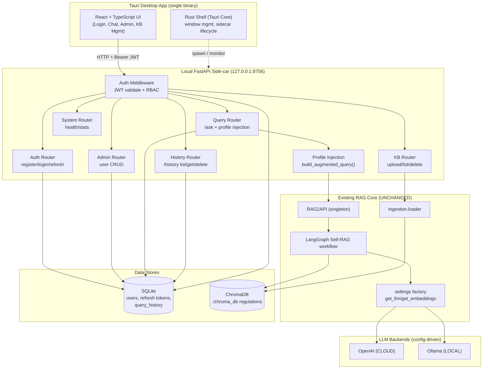
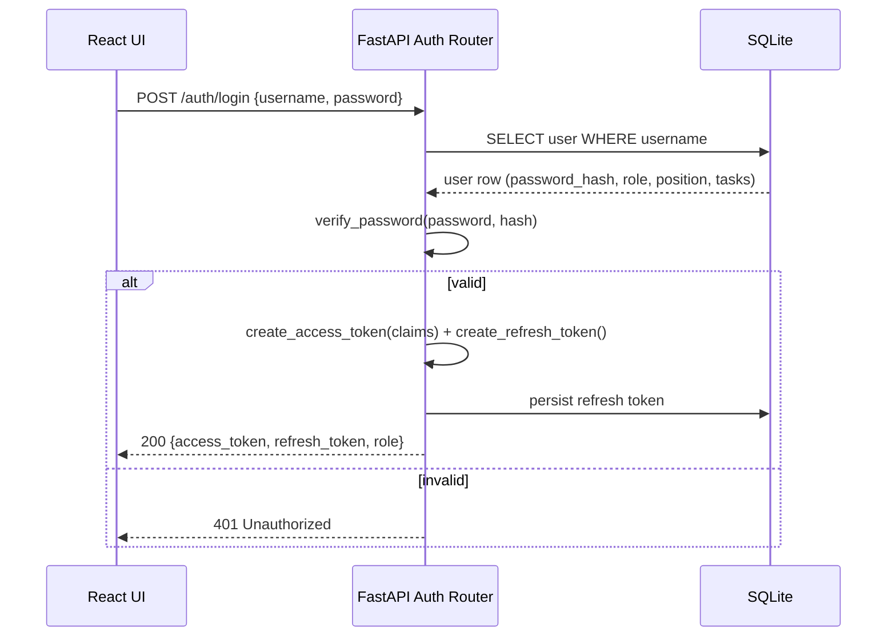
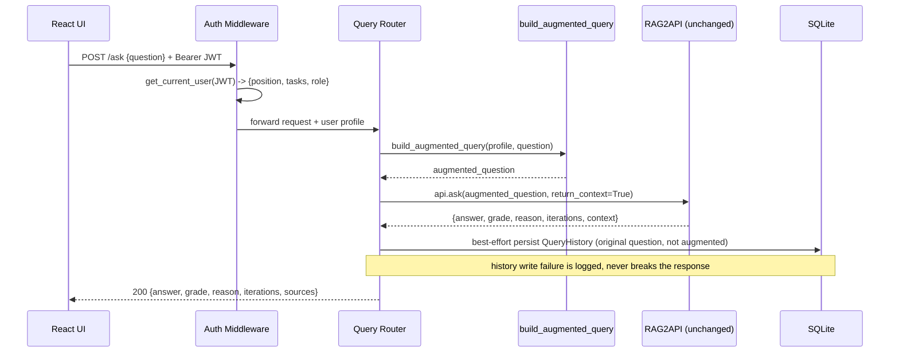
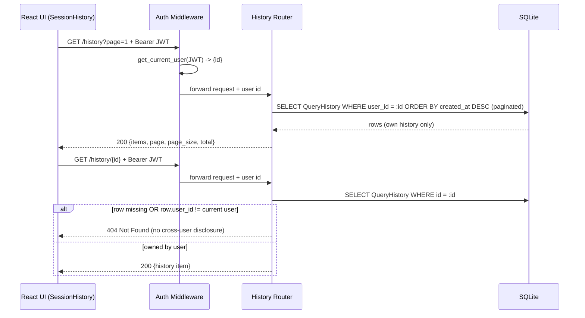
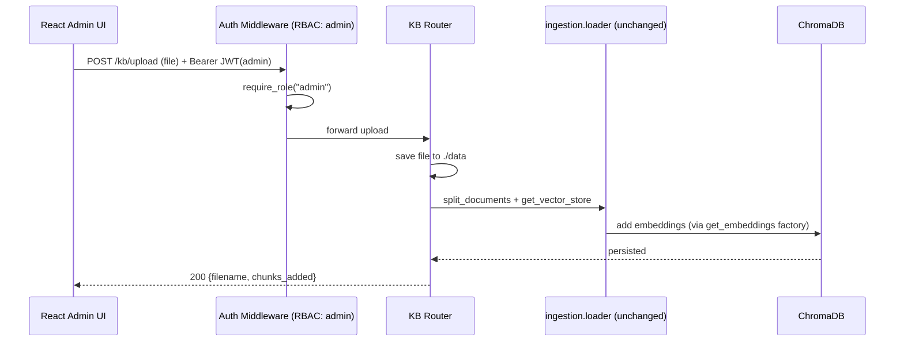
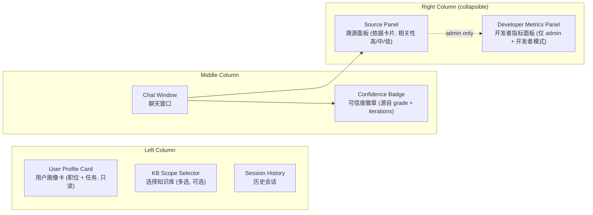

# Design Document: Enterprise Regulation RAG Desktop

## Overview

This feature wraps the existing Python Self-RAG engine (LangChain + LangGraph + ChromaDB) into a
desktop-level enterprise regulation (条例) query system for company employees. The desktop client is
built with **Tauri** (Rust shell hosting a **React + TypeScript** UI). The UI communicates over local
HTTP with a **FastAPI side-car service** that wraps the existing `RAG2API` singleton.

Two cross-cutting capabilities are added around the untouched RAG core:

1. **Local account system** — accounts stored in SQLite, passwords hashed with `bcrypt`, sessions
   issued as JWT, and role-based access control (`admin`, `employee`). Admins manage employee
   accounts including their `position` (职位) and `tasks` (任务).
2. **Position-aware retrieval** — when an employee asks a question, the service fetches the user's
   profile (position + tasks) from the validated JWT and injects it into the retrieval query via a
   pure query-augmentation step at the API layer. The existing LangGraph Self-RAG logic and
   `RAG2API` are reused with **zero business-logic changes**.

The existing Streamlit prototype (`app.py`) is referenced for feature parity (chat, knowledge-base
upload, statistics) but is replaced by the new desktop client.

### Design Principle: Zero RAG Core Changes

The RAG core (`src/api/rag_api.py`, `src/graph/*`, `src/config/settings.py`, `src/ingestion/loader.py`)
MUST NOT be modified. All new behavior is additive:

- Profile injection is implemented as a **string transformation** (`build_augmented_query`) that
  produces an augmented question, which is then passed to the existing `RAG2API.ask(question, ...)`.
  Because `retrieve_node` seeds `current_query` from `question`, augmenting the question text steers
  semantic retrieval toward position-relevant regulations without touching any node.
- Model access continues to flow exclusively through the `settings` factory (`get_llm`,
  `get_embeddings`); new code never imports model classes directly.

---

# PART 1 — High-Level Design

## Architecture



### Architectural Layers

| Layer | Technology | Responsibility |
|-------|-----------|----------------|
| Presentation | React + TypeScript (in Tauri WebView) | Login/session UI, chat, admin console, KB management |
| Desktop Shell | Tauri (Rust) | Native window, side-car process lifecycle, secure storage of base URL |
| API Service | FastAPI + Uvicorn (Python) | Auth, RBAC, profile injection, KB ops, system status |
| Domain (reused) | `RAG2API` + LangGraph | Self-RAG retrieval/generation/grading (unchanged) |
| Persistence | SQLite (accounts) + ChromaDB (vectors) | User data, refresh tokens, per-user query history, and regulation embeddings |
| Model backends | OpenAI / Ollama via factory | Dual-mode CLOUD/LOCAL inference |

## Request / Data Flow Diagrams

### Flow 1: Employee Login



### Flow 2: Position-Aware Query



### Flow 2b: Query History Retrieval (per-user)



### Flow 3: Admin Knowledge-Base Upload



## Components and Interfaces

### Component 1: Auth Subsystem (FastAPI)

**Purpose**: Issue and validate JWTs, hash/verify passwords, enforce RBAC.

**Interface**:
```python
def hash_password(plain: str) -> str: ...
def verify_password(plain: str, password_hash: str) -> bool: ...
def create_access_token(claims: dict, expires_minutes: int) -> str: ...
def create_refresh_token(user_id: int) -> str: ...
def decode_token(token: str) -> dict: ...
async def get_current_user(token: str = Depends(oauth2_scheme)) -> UserContext: ...
def require_role(*roles: str) -> Callable: ...  # FastAPI dependency factory
```

**Responsibilities**:
- bcrypt hashing via `passlib`
- JWT issuance/validation via `python-jose`
- Resolve `UserContext` (id, username, role, position, tasks) from token claims
- Block requests lacking required role with HTTP 403

### Component 2: Profile Injection (API layer)

**Purpose**: Convert user profile + question into a position-aware augmented query without touching the RAG core.

**Interface**:
```python
def build_augmented_query(profile: UserProfile, question: str) -> str: ...
```

**Responsibilities**:
- Compose a query that prepends/weights position + tasks context
- Preserve the original question intent (the original question remains the dominant clause)
- Be a pure function (deterministic, no I/O) for testability

### Component 3: Query Router

**Purpose**: Orchestrate a single employee question end-to-end.

**Interface**:
```python
@router.post("/ask", response_model=AskResponse)
async def ask(req: AskRequest, user: UserContext = Depends(get_current_user)) -> AskResponse: ...
```

**Responsibilities**: build augmented query, call `RAG2API.ask`, map result dict to `AskResponse`,
and best-effort persist a `QueryHistory` row (recording the **original** question, not the augmented one).

### Component 3b: History Router

**Purpose**: Per-user query-history retrieval and management. History is **private to each user**:
identity is derived from the validated JWT, never from a client-supplied user id.

**Interface**:
```python
@router.get("/history", response_model=HistoryListResponse)
async def list_history(page: int = 1, page_size: int = 20,
                       user: UserContext = Depends(get_current_user)) -> HistoryListResponse: ...

@router.get("/history/{history_id}", response_model=HistoryItem)
async def get_history(history_id: int, user: UserContext = Depends(get_current_user)) -> HistoryItem: ...

@router.delete("/history/{history_id}", status_code=204)
async def delete_history(history_id: int, user: UserContext = Depends(get_current_user)) -> None: ...

# Optional / audit-only — admin can view all users' history
@router.get("/admin/history", response_model=HistoryListResponse,
            dependencies=[Depends(require_role("admin"))])
async def admin_list_history(page: int = 1, page_size: int = 20,
                             user_id: int | None = None) -> HistoryListResponse: ...
```

**Responsibilities**:
- List the current user's own history, paginated, newest first (`ORDER BY created_at DESC`).
- Fetch a single history item only if it belongs to the requester; otherwise 404 (no cross-user disclosure).
- Delete one of the user's own history items.
- (Optional) `GET /admin/history` is an **audit capability** gated by `require_role("admin")` that can
  view all users' history; it is not part of the employee surface.

### Component 4: Admin Router (User CRUD)

**Purpose**: Admin-only employee management.

**Interface**:
```python
@router.post("/admin/users", dependencies=[Depends(require_role("admin"))])
@router.get("/admin/users", dependencies=[Depends(require_role("admin"))])
@router.get("/admin/users/{user_id}", dependencies=[Depends(require_role("admin"))])
@router.put("/admin/users/{user_id}", dependencies=[Depends(require_role("admin"))])
@router.delete("/admin/users/{user_id}", dependencies=[Depends(require_role("admin"))])
```

**Responsibilities**: create/list/read/update/delete employees; assign `position` and `tasks`.

### Component 5: KB Router

**Purpose**: Regulation document lifecycle, reusing existing ingestion.

**Interface**:
```python
@router.post("/kb/upload", dependencies=[Depends(require_role("admin"))])
@router.get("/kb/list")
@router.delete("/kb/{doc_id}", dependencies=[Depends(require_role("admin"))])
```

**Responsibilities**: persist files to `./data`, vectorize via `ingestion.loader`, list/delete entries.

### Component 6: Tauri/React Client

**Purpose**: Desktop UI and side-car lifecycle.

**Responsibilities**:
- Spawn/monitor the FastAPI side-car bound to `127.0.0.1`
- Store JWT in memory + secure storage; attach `Authorization: Bearer` header
- Render login, chat, admin console, KB management; route by role

## Frontend UI Layout (Three-Column, Role-Based)

The desktop client uses a single three-column layout shared by all roles. Visibility is
**permission-driven (progressive disclosure, "Option B")**: employees see a simplified,
trust-oriented view, while admins can reveal engineering detail through a Developer Mode toggle.
This avoids maintaining two separate UIs while still keeping employees focused on answers and their
regulatory basis rather than raw retrieval internals.



### Layout Responsibilities

| Region | Component | Audience | Responsibility |
|--------|-----------|----------|----------------|
| Left · top | User Profile Card (用户画像卡) | All | Prominently show the logged-in employee's `position` (职位) and `tasks` (任务), read-only for employees. Visually reinforces the core value: retrieval is tailored to the user's role. |
| Left | KB Scope Selector (选择知识库) | All | Optional multi-select of knowledge-base scope. |
| Left | Session History (历史会话) | All | List and reopen previous conversations. Backed by `GET /history` (per-user, newest first); clicking an item reloads that Q&A (question + answer + badge/sources when available). |
| Middle | Chat Window (聊天窗口) | All | Ask questions and read answers. |
| Middle | Confidence Badge (可信度徽章) | All | Per-answer trust signal derived from existing RAG fields `grade` (YES/NO) and `iterations` — **never raw scores**. |
| Right (default) | Source Panel (溯源面板) | All | Answer-basis cards: regulation title, chapter/section, original excerpt, and a human-readable relevance label (高/中/低) translated from the cosine score — **never the raw numeric score**. |
| Right (extra) | Developer Metrics Panel (开发者指标面板) | Admin + Developer Mode | Engineering metrics: retrieved chunks, raw scores, token cost, latency, retrieval timing. |

### Role-Based UI: Employee View vs Admin Developer View

- **Employee (simplified view)**: three columns with Profile Card, KB scope, history, chat with a
  Confidence Badge, and the simplified Source Panel. Tuning parameters and raw engineering metrics are
  hidden. The experience emphasizes *what the answer is* and *which regulation backs it*.
- **Admin (developer view)**: identical base layout plus a **Developer Mode toggle (开发者模式开关)**
  that is *only* visible to the `admin` role. When ON, the right panel additionally reveals the
  Developer Metrics Panel. When OFF (and always for employees), only the simplified Source Panel shows.

### Confidence Badge Mapping (grade + iterations → 高/中/低)

The badge translates RAG signals into plain language rather than exposing scores:

- `grade = YES` → "✓ 已核验，依据 N 条条例" (N = number of source cards). Confidence **高** when
  answered within few iterations; **中** when it took more iterations (near the iteration cap).
- `grade = NO` → "⚠ 未找到明确依据，建议人工确认" → confidence **低**.

### Source Relevance Label (cosine score → 高/中/低)

Each source card maps the underlying cosine similarity into a human-readable band (高/中/低). Employees
never see the numeric score; the band communicates trust without implying false precision.

### Admin-Only Sections

- **管理后台 entry**: user management CRUD + knowledge-base management (reuses Admin Router and KB Router).
- **Advanced Settings (高级设置)**: global/default tuning values configurable only by admin —
  `top_k`, **enable reranker**, **enable hybrid search**. These are *not* shown to employees.
  - **Forward-looking flags**: reranker and hybrid search are **not implemented in the RAG core today**.
    They are modeled as admin feature flags the design accommodates *without requiring RAG-core changes
    now* — the API can carry the flags, but the core may ignore them until implemented. Documented as
    optional/future capabilities.
- **系统监控 / 用量统计 (System Monitoring / Usage)**: aggregate usage and cost view for admins.
  Latency and token cost are most meaningful in **CLOUD** mode; in **LOCAL (Ollama)** mode they are
  informational only. Cost/usage is surfaced as an admin aggregate view rather than per-message for
  employees.

## Data Models

### Model: User (SQLite via SQLModel)

```python
class User(SQLModel, table=True):
    id: int | None = Field(default=None, primary_key=True)
    username: str = Field(index=True, unique=True)
    password_hash: str
    role: str = Field(default="employee")   # "admin" | "employee"
    position: str = Field(default="")        # 职位
    tasks: str = Field(default="")           # 任务 (newline- or JSON-encoded list)
    is_active: bool = Field(default=True)
    created_at: datetime = Field(default_factory=datetime.utcnow)
    updated_at: datetime = Field(default_factory=datetime.utcnow)
```

**Validation Rules**:
- `username` non-empty, unique, length 3–64
- `role` ∈ {"admin", "employee"}
- `password_hash` is always a bcrypt hash, never plaintext

### Model: RefreshToken (SQLite)

```python
class RefreshToken(SQLModel, table=True):
    id: int | None = Field(default=None, primary_key=True)
    user_id: int = Field(foreign_key="user.id", index=True)
    token: str = Field(index=True, unique=True)
    expires_at: datetime
    revoked: bool = Field(default=False)
```

### Model: QueryHistory (SQLite via SQLModel)

```python
class QueryHistory(SQLModel, table=True):
    id: int | None = Field(default=None, primary_key=True)
    user_id: int = Field(foreign_key="user.id", index=True)  # 历史按用户隔离（私有）
    question: str             # 员工的原始问题（绝非增强后的查询）
    answer: str               # RAG 返回的答案文本
    grade: str                # "YES" | "NO"
    iterations: int           # 自我修正迭代次数
    success: bool             # RAG 是否成功
    source_count: int = Field(default=0)  # 可选：依据条数（不存原始向量/分块）
    created_at: datetime = Field(default_factory=datetime.utcnow)
```

**Validation / Privacy Rules**:
- `question` stores the **original employee question only** — never the augmented query.
- The full augmented query and raw chunk vectors are **never** persisted.
- History is **per-user**: every read/delete is scoped to `user_id` resolved from the JWT.

### Model: API DTOs (Pydantic)

```python
class UserProfile(BaseModel):
    position: str
    tasks: list[str]

class UserContext(BaseModel):
    id: int
    username: str
    role: str
    position: str
    tasks: list[str]

class AskRequest(BaseModel):
    question: str
    return_context: bool = True

class SourceItem(BaseModel):
    content: str
    source: str

class AskResponse(BaseModel):
    answer: str
    grade: str
    reason: str
    iterations: int
    success: bool
    sources: list[SourceItem] = []

class HistoryItem(BaseModel):
    id: int
    question: str        # 原始问题
    answer: str
    grade: str
    iterations: int
    success: bool
    source_count: int = 0
    created_at: datetime

class HistoryListResponse(BaseModel):
    items: list[HistoryItem]
    page: int
    page_size: int
    total: int
```

**Validation Rules**:
- `AskRequest.question` non-empty after trimming whitespace
- `tasks` is a list of non-empty strings

## Error Handling

| Scenario | Condition | Response | Recovery |
|----------|-----------|----------|----------|
| Invalid credentials | login password mismatch | 401 with generic message | user retries |
| Missing/expired JWT | protected route | 401 | client refreshes via `/auth/refresh` |
| Insufficient role | employee hits admin route | 403 | UI hides admin actions |
| Empty question | blank/whitespace question | 422 validation error | UI inline validation |
| RAG failure | `api.ask` returns `success=False` | 200 with `success=false`, `answer` carries error text | UI shows degraded message |
| Duplicate username | admin creates existing user | 409 conflict | admin chooses new name |
| Unsupported upload | KB upload non-supported ext | 415 unsupported media type | admin converts file |
| Cross-user history access | user requests/deletes another user's `history_id` | 404 Not Found (no cross-user disclosure) | UI only lists the user's own history |
| History persistence failure | DB write fails after a RAG response | response still returned; failure logged (best-effort) | history may be missing that entry; answer unaffected |

## Testing Strategy

### Unit Testing Approach
Concrete examples and edge cases for auth (hash/verify, token decode), DTO validation, route status
codes, and KB extension filtering.

### Property-Based Testing Approach
Universal properties for password round-trip, token claim round-trip, query-augmentation invariants,
and RBAC monotonicity. **Property Test Library**: `hypothesis` (Python).

### Integration Testing Approach
1–3 representative end-to-end checks: login → ask → receive answer; admin upload → list reflects new
doc. RAG core is exercised with a stubbed/mocked `RAG2API.ask` to keep tests fast and deterministic.

## Performance Considerations
- `RAG2API` is a singleton initialized once at side-car startup (avoids repeated ChromaDB/workflow load).
- Side-car bound to loopback to avoid network overhead and exposure.
- JWT validation is in-memory (no DB hit) except for refresh-token rotation.

## Security Considerations
- Passwords hashed with bcrypt (`passlib[bcrypt]`); plaintext never stored or logged.
- JWT signed with an HS256 secret loaded from environment/secure local file; secret never hard-coded.
- FastAPI side-car binds to `127.0.0.1` only — not reachable off-host; still protected by JWT to guard
  against other local processes.
- Password policy: minimum length 8, must contain letters and digits (enforced server-side).
- Admin bootstrap: a single initial admin is seeded on first run from env vars, then forced to change password.

## Dependencies

**Python (side-car)**: `fastapi`, `uvicorn`, `python-jose[cryptography]`, `passlib[bcrypt]`,
`sqlmodel` (SQLAlchemy), `python-multipart` (uploads) — added on top of existing LangChain/LangGraph/Chroma deps.

**Desktop**: `Tauri`, `React`, `TypeScript`, an HTTP client (`fetch`/`axios`), and a state/store library.

---

# PART 2 — Low-Level Design

This part provides concrete signatures and pseudocode. Code is in Python (side-car) and
TypeScript (desktop client). Comments default to Chinese per project conventions.

## Module Layout (new code, additive)

```
src/
  server/                     # 新增：FastAPI 侧车服务
    __init__.py
    main.py                   # FastAPI app 工厂 + 路由挂载 + 启动 RAG2API
    config.py                 # JWT 密钥、过期时间、绑定地址等服务级配置
    db.py                     # SQLModel engine / session / init_db / seed_admin
    models.py                 # User, RefreshToken 表模型
    schemas.py                # Pydantic DTO（请求/响应）
    security.py               # hash/verify/token/get_current_user/require_role
    injection.py              # build_augmented_query（纯函数）
    routers/
      auth.py                 # /auth/register, /auth/login, /auth/refresh
      query.py                # /ask（成功/失败后写入 QueryHistory）
      history.py              # /history list/get/delete (+ 可选 /admin/history 审计)
      admin.py                # /admin/users CRUD
      kb.py                   # /kb upload/list/delete
      system.py               # /system/health, /system/stats
desktop/                      # 新增：Tauri + React + TS 客户端
  src-tauri/                  # Rust 外壳与侧车生命周期
  src/                        # React UI
    api/client.ts             # API 客户端（附带 Bearer JWT）
    auth/session.ts           # 会话状态管理
    pages/{Login,Chat,Admin,KnowledgeBase}.tsx
```

## Core Interfaces / Types

```python
# src/server/schemas.py
from pydantic import BaseModel, field_validator

class UserProfile(BaseModel):
    position: str
    tasks: list[str]

class UserContext(BaseModel):
    id: int
    username: str
    role: str            # "admin" | "employee"
    position: str
    tasks: list[str]

class AskRequest(BaseModel):
    question: str
    return_context: bool = True

    @field_validator("question")
    @classmethod
    def _not_blank(cls, v: str) -> str:
        # 问题去除首尾空白后不能为空
        if not v or not v.strip():
            raise ValueError("question must not be blank")
        return v.strip()
```

## Low-Level: Security (auth)

```python
# src/server/security.py
from datetime import datetime, timedelta
from passlib.context import CryptContext
from jose import jwt, JWTError
from fastapi import Depends, HTTPException, status
from fastapi.security import OAuth2PasswordBearer

pwd_context = CryptContext(schemes=["bcrypt"], deprecated="auto")
oauth2_scheme = OAuth2PasswordBearer(tokenUrl="/auth/login")

def hash_password(plain: str) -> str:
    # 使用 bcrypt 生成密码哈希，绝不存储明文
    return pwd_context.hash(plain)

def verify_password(plain: str, password_hash: str) -> bool:
    # 校验明文与哈希是否匹配
    return pwd_context.verify(plain, password_hash)

def create_access_token(claims: dict, expires_minutes: int = 30) -> str:
    # 签发短期 access token（HS256），注入 sub/role/position/tasks 等声明
    to_encode = claims.copy()
    to_encode["exp"] = datetime.utcnow() + timedelta(minutes=expires_minutes)
    to_encode["type"] = "access"
    return jwt.encode(to_encode, settings.JWT_SECRET, algorithm="HS256")

def create_refresh_token(user_id: int, expires_days: int = 7) -> str:
    # 签发长期 refresh token，并由调用方持久化到 SQLite 以支持吊销
    to_encode = {
        "sub": str(user_id),
        "type": "refresh",
        "exp": datetime.utcnow() + timedelta(days=expires_days),
    }
    return jwt.encode(to_encode, settings.JWT_SECRET, algorithm="HS256")

def decode_token(token: str) -> dict:
    # 解码并验证签名/过期；失败抛出 401
    try:
        return jwt.decode(token, settings.JWT_SECRET, algorithms=["HS256"])
    except JWTError:
        raise HTTPException(status.HTTP_401_UNAUTHORIZED, "Invalid or expired token")

async def get_current_user(token: str = Depends(oauth2_scheme)) -> UserContext:
    # 从 access token 声明中还原用户上下文（含 position/tasks），供 profile 注入使用
    payload = decode_token(token)
    if payload.get("type") != "access":
        raise HTTPException(status.HTTP_401_UNAUTHORIZED, "Not an access token")
    return UserContext(
        id=int(payload["sub"]),
        username=payload["username"],
        role=payload["role"],
        position=payload.get("position", ""),
        tasks=payload.get("tasks", []),
    )

def require_role(*roles: str):
    # 依赖工厂：限定路由可访问的角色，否则 403
    async def _dep(user: UserContext = Depends(get_current_user)) -> UserContext:
        if user.role not in roles:
            raise HTTPException(status.HTTP_403_FORBIDDEN, "Insufficient role")
        return user
    return _dep
```

## Low-Level: Profile Injection (position-aware retrieval)

Strategy: **query augmentation by weighting** at the API layer. The original question stays dominant;
position + tasks are appended as steering context. This keeps `RAG2API` and all LangGraph nodes
untouched because `retrieve_node` seeds `current_query` from the (augmented) `question` string.

```python
# src/server/injection.py
from src.server.schemas import UserProfile

def build_augmented_query(profile: UserProfile, question: str) -> str:
    """根据用户档案（职位 + 任务）对问题做查询增强，实现职位感知检索。

    设计要点：
    - 原始问题作为主导子句保留，保证不偏离用户真实意图。
    - 职位/任务作为"检索引导上下文"附加，借助语义相似度加权相关条例。
    - 纯函数：确定性、无副作用、无 I/O，便于属性测试。
    """
    question = question.strip()
    parts: list[str] = []

    position = (profile.position or "").strip()
    tasks = [t.strip() for t in (profile.tasks or []) if t and t.strip()]

    # 仅当档案信息存在时才注入，避免污染空档案用户的查询
    if position:
        parts.append(f"[岗位背景] 提问者职位为：{position}。")
    if tasks:
        parts.append(f"[职责背景] 其主要任务包括：{'、'.join(tasks)}。")

    parts.append(f"[问题] {question}")
    parts.append("请优先检索与上述岗位职责最相关的公司条例并据此作答。")
    return "\n".join(parts)
```

### Filtering vs Weighting decision

| Strategy | Mechanism | Touches RAG core? | Chosen |
|----------|-----------|-------------------|--------|
| Metadata filtering | pass `filter=` to `similarity_search` | Yes (edit `nodes.py`) | ❌ No |
| Query weighting | augment question text only | No | ✅ Yes (primary) |

Weighting is selected to honor the zero-core-change constraint. If stricter scoping is later required,
an optional API-layer re-rank over `result["context"]` can be added without core edits.

## Low-Level: SQLite Models & DB

```python
# src/server/models.py
from datetime import datetime
from sqlmodel import SQLModel, Field

class User(SQLModel, table=True):
    id: int | None = Field(default=None, primary_key=True)
    username: str = Field(index=True, unique=True)
    password_hash: str
    role: str = Field(default="employee")     # "admin" | "employee"
    position: str = Field(default="")          # 职位
    tasks: str = Field(default="[]")           # 任务，JSON 编码的字符串列表
    is_active: bool = Field(default=True)
    created_at: datetime = Field(default_factory=datetime.utcnow)
    updated_at: datetime = Field(default_factory=datetime.utcnow)

class RefreshToken(SQLModel, table=True):
    id: int | None = Field(default=None, primary_key=True)
    user_id: int = Field(foreign_key="user.id", index=True)
    token: str = Field(index=True, unique=True)
    expires_at: datetime
    revoked: bool = Field(default=False)

class QueryHistory(SQLModel, table=True):
    id: int | None = Field(default=None, primary_key=True)
    user_id: int = Field(foreign_key="user.id", index=True)  # 历史按用户隔离（私有）
    question: str             # 员工原始问题（绝非增强后的查询）
    answer: str               # RAG 答案文本
    grade: str                # "YES" | "NO"
    iterations: int           # 迭代次数
    success: bool             # RAG 是否成功
    source_count: int = Field(default=0)  # 可选：依据条数；不存向量/分块原文
    created_at: datetime = Field(default_factory=datetime.utcnow)
```

```python
# src/server/db.py
from sqlmodel import SQLModel, Session, create_engine, select
engine = create_engine("sqlite:///./accounts.db", connect_args={"check_same_thread": False})

def init_db() -> None:
    # 创建所有表
    SQLModel.metadata.create_all(engine)

def get_session() -> Session:
    # FastAPI 依赖：提供数据库会话
    with Session(engine) as session:
        yield session

def seed_admin() -> None:
    # 首次启动时从环境变量播种初始 admin 账户（仅当不存在时）
    with Session(engine) as s:
        exists = s.exec(select(User).where(User.role == "admin")).first()
        if not exists:
            s.add(User(
                username=settings.BOOTSTRAP_ADMIN_USER,
                password_hash=hash_password(settings.BOOTSTRAP_ADMIN_PASSWORD),
                role="admin",
            ))
            s.commit()
```

## Low-Level: FastAPI Route Handlers

```python
# src/server/routers/auth.py
@router.post("/auth/login", response_model=TokenResponse)
def login(form: OAuth2PasswordRequestForm = Depends(), s: Session = Depends(get_session)):
    user = s.exec(select(User).where(User.username == form.username)).first()
    if not user or not verify_password(form.password, user.password_hash):
        raise HTTPException(401, "Invalid credentials")  # 通用错误信息，避免泄露用户存在性
    claims = {"sub": str(user.id), "username": user.username, "role": user.role,
              "position": user.position, "tasks": json.loads(user.tasks)}
    access = create_access_token(claims)
    refresh = create_refresh_token(user.id)
    persist_refresh_token(s, user.id, refresh)
    return TokenResponse(access_token=access, refresh_token=refresh, role=user.role)
```

```python
# src/server/routers/query.py
@router.post("/ask", response_model=AskResponse)
def ask(req: AskRequest, user: UserContext = Depends(get_current_user),
        s: Session = Depends(get_session)):
    # 1) 从已验证 JWT 取出档案；2) 查询增强；3) 调用未改动的 RAG2API
    profile = UserProfile(position=user.position, tasks=user.tasks)
    augmented = build_augmented_query(profile, req.question)
    result = RAG2API().ask(augmented, return_context=req.return_context)  # 单例，零改动
    resp = AskResponse(
        answer=result["answer"], grade=result["grade"], reason=result["reason"],
        iterations=result["iterations"], success=result["success"],
        sources=[SourceItem(**c) for c in result.get("context", [])],
    )
    # 4) 尽力而为地持久化查询历史：记录“原始问题”（非增强查询）与响应字段。
    #    写库失败不得影响响应，仅记录日志（best-effort）。
    try:
        s.add(QueryHistory(
            user_id=user.id,
            question=req.question,          # 关键：存原始问题，绝非 augmented
            answer=resp.answer, grade=resp.grade,
            iterations=resp.iterations, success=resp.success,
            source_count=len(resp.sources),
        ))
        s.commit()
    except Exception:
        s.rollback()
        logger.exception("Failed to persist QueryHistory; returning answer anyway")
    return resp
```

```python
# src/server/routers/history.py
# 历史按用户隔离：身份一律取自 JWT（user.id），绝不信任客户端传入的 user_id。

@router.get("/history", response_model=HistoryListResponse)
def list_history(page: int = 1, page_size: int = 20,
                 user: UserContext = Depends(get_current_user),
                 s: Session = Depends(get_session)):
    # 仅返回当前用户自己的历史，按时间倒序分页
    base = select(QueryHistory).where(QueryHistory.user_id == user.id)
    total = len(s.exec(base).all())
    rows = s.exec(
        base.order_by(QueryHistory.created_at.desc())
            .offset((page - 1) * page_size).limit(page_size)
    ).all()
    return HistoryListResponse(
        items=[to_history_item(r) for r in rows],
        page=page, page_size=page_size, total=total,
    )

@router.get("/history/{history_id}", response_model=HistoryItem)
def get_history(history_id: int, user: UserContext = Depends(get_current_user),
                s: Session = Depends(get_session)):
    row = s.get(QueryHistory, history_id)
    # 不存在或不属于当前用户都返回 404，避免跨用户存在性泄露
    if not row or row.user_id != user.id:
        raise HTTPException(404, "History not found")
    return to_history_item(row)

@router.delete("/history/{history_id}", status_code=204)
def delete_history(history_id: int, user: UserContext = Depends(get_current_user),
                   s: Session = Depends(get_session)):
    row = s.get(QueryHistory, history_id)
    if not row or row.user_id != user.id:
        raise HTTPException(404, "History not found")
    s.delete(row); s.commit()

# 可选 / 审计能力：管理员可查看所有用户历史（require_role("admin")）
@router.get("/admin/history", response_model=HistoryListResponse,
            dependencies=[Depends(require_role("admin"))])
def admin_list_history(page: int = 1, page_size: int = 20, user_id: int | None = None,
                       s: Session = Depends(get_session)):
    base = select(QueryHistory)
    if user_id is not None:
        base = base.where(QueryHistory.user_id == user_id)
    total = len(s.exec(base).all())
    rows = s.exec(
        base.order_by(QueryHistory.created_at.desc())
            .offset((page - 1) * page_size).limit(page_size)
    ).all()
    return HistoryListResponse(
        items=[to_history_item(r) for r in rows],
        page=page, page_size=page_size, total=total,
    )
```

```python
# src/server/routers/admin.py  (全部依赖 require_role("admin"))
@router.post("/admin/users", response_model=UserOut)
def create_user(body: UserCreate, s: Session = Depends(get_session)):
    if s.exec(select(User).where(User.username == body.username)).first():
        raise HTTPException(409, "Username already exists")
    user = User(username=body.username, password_hash=hash_password(body.password),
                role=body.role, position=body.position, tasks=json.dumps(body.tasks))
    s.add(user); s.commit(); s.refresh(user)
    return to_user_out(user)

@router.put("/admin/users/{user_id}", response_model=UserOut)
def update_user(user_id: int, body: UserUpdate, s: Session = Depends(get_session)):
    # 支持更新 position（职位）与 tasks（任务）等字段
    user = s.get(User, user_id) or _404()
    if body.position is not None: user.position = body.position
    if body.tasks is not None: user.tasks = json.dumps(body.tasks)
    if body.role is not None: user.role = body.role
    user.updated_at = datetime.utcnow()
    s.add(user); s.commit(); s.refresh(user)
    return to_user_out(user)
```

```python
# src/server/routers/kb.py
@router.post("/kb/upload", dependencies=[Depends(require_role("admin"))])
def upload(file: UploadFile = File(...)):
    ext = os.path.splitext(file.filename)[1].lower()
    if ext not in SUPPORTED_EXTENSIONS:                 # 复用 loader 的支持类型
        raise HTTPException(415, f"Unsupported extension: {ext}")
    dest = os.path.join("./data", file.filename)
    save_upload(dest, file)
    docs = load_documents_from_directory("./data")       # 复用现有摄取逻辑
    chunks = split_documents(docs)
    get_vector_store().add_documents(chunks)             # 经 settings 工厂生成 embeddings
    return {"filename": file.filename, "chunks_added": len(chunks)}
```

## Low-Level: System Router

```python
# src/server/routers/system.py
@router.get("/system/health")
def health():
    return RAG2API().health_check()      # 直接复用现有健康检查

@router.get("/system/stats", dependencies=[Depends(get_current_user)])
def stats():
    return RAG2API().get_statistics()    # 直接复用现有统计
```

## Low-Level: Tauri/React API Client

```typescript
// desktop/src/api/client.ts
const BASE_URL = "http://127.0.0.1:8756"; // 侧车仅绑定回环地址

let accessToken: string | null = null;
export function setToken(t: string | null) { accessToken = t; }

async function request<T>(path: string, init: RequestInit = {}): Promise<T> {
  // 统一附加 Bearer JWT；401 时触发刷新流程
  const headers = new Headers(init.headers);
  if (accessToken) headers.set("Authorization", `Bearer ${accessToken}`);
  if (!(init.body instanceof FormData)) headers.set("Content-Type", "application/json");
  const res = await fetch(`${BASE_URL}${path}`, { ...init, headers });
  if (res.status === 401) throw new UnauthorizedError();
  if (!res.ok) throw new ApiError(res.status, await res.text());
  return res.json() as Promise<T>;
}

export const api = {
  login: (username: string, password: string) =>
    request<TokenResponse>("/auth/login", {
      method: "POST",
      headers: { "Content-Type": "application/x-www-form-urlencoded" },
      body: new URLSearchParams({ username, password }),
    }),
  ask: (question: string) =>
    request<AskResponse>("/ask", { method: "POST", body: JSON.stringify({ question }) }),
  listHistory: (page = 1, pageSize = 20) =>
    request<HistoryListResponse>(`/history?page=${page}&page_size=${pageSize}`),
  getHistory: (id: number) => request<HistoryItem>(`/history/${id}`),
  deleteHistory: (id: number) =>
    request<void>(`/history/${id}`, { method: "DELETE" }),
  listUsers: () => request<UserOut[]>("/admin/users"),
  uploadDoc: (file: File) => {
    const fd = new FormData(); fd.append("file", file);
    return request<UploadResult>("/kb/upload", { method: "POST", body: fd });
  },
};
```

## Low-Level: Frontend UI Layout (React component tree)

The Chat page composes the three-column layout. All role-gating funnels through a single
`useDeveloperMode()` hook so visibility logic stays in one place. Components consume the existing
`AskResponse` shape; engineering-only metrics live behind the admin Developer Mode gate.

```
desktop/src/
  pages/
    Chat.tsx                       # 三栏布局容器：组合左/中/右三列
    Admin.tsx                      # 管理后台：用户 CRUD + 知识库管理 + 高级设置入口
  components/
    layout/
      ThreeColumnLayout.tsx        # 通用三栏骨架（左/中/右，右列可折叠）
    left/
      ProfileCard.tsx              # 用户画像卡：展示职位 + 任务（员工只读）
      KbScopeSelector.tsx          # 选择知识库（多选, 可选）
      SessionHistory.tsx           # 历史会话列表
    middle/
      ChatWindow.tsx               # 聊天窗口：消息流 + 输入框
      ConfidenceBadge.tsx          # 可信度徽章：由 grade + iterations 推导
    right/
      SourcePanel.tsx              # 溯源面板：依据卡片（相关性 高/中/低）
      DeveloperMetricsPanel.tsx    # 开发者指标面板（仅 admin + 开发者模式）
    admin/
      AdvancedSettings.tsx         # 高级设置：top_k / reranker / hybrid（仅 admin）
      DeveloperModeToggle.tsx      # 开发者模式开关（仅 admin 可见）
      SystemUsage.tsx              # 系统监控/用量统计（管理员聚合视图）
  hooks/
    useDeveloperMode.ts            # 角色门控 + 开发者模式状态
  types/
    chat.ts                        # 前端类型（SourceCard, ConfidenceLevel 等）
```

### Composition: `pages/Chat.tsx`

```tsx
// desktop/src/pages/Chat.tsx
export function Chat() {
  const { role, developerMode } = useDeveloperMode();
  const [messages, setMessages] = useState<ChatMessage[]>([]);
  const [activeAnswer, setActiveAnswer] = useState<AskResponse | null>(null);

  return (
    <ThreeColumnLayout
      left={
        <>
          <ProfileCard />                 {/* 顶部：用户画像卡（职位 + 任务，只读） */}
          <KbScopeSelector />             {/* 选择知识库（多选, 可选） */}
          <SessionHistory />              {/* 历史会话 */}
        </>
      }
      middle={
        <ChatWindow
          messages={messages}
          onAnswer={setActiveAnswer}
          renderBadge={(r) => (
            // 每条回答渲染可信度徽章：仅依据 grade + iterations，不暴露原始分数
            <ConfidenceBadge grade={r.grade} iterations={r.iterations}
                             sourceCount={r.sources.length} />
          )}
        />
      }
      right={
        <>
          {/* 默认（员工视图）：仅展示简化的溯源面板 */}
          <SourcePanel sources={activeAnswer?.sources ?? []} />
          {/* 仅 admin 且开启开发者模式时，额外展示工程指标 */}
          {role === "admin" && developerMode && (
            <DeveloperMetricsPanel answer={activeAnswer} />
          )}
        </>
      }
      rightCollapsible
    />
  );
}
```

### Role-gating hook: `useDeveloperMode()`

```typescript
// desktop/src/hooks/useDeveloperMode.ts
import { useSession } from "../auth/session";

export function useDeveloperMode() {
  const { role } = useSession();                 // "admin" | "employee"
  const [enabled, setEnabled] = useState(false);

  // 开发者模式开关只对 admin 生效；员工永远拿到 false，无法开启
  const developerMode = role === "admin" && enabled;
  const canToggleDeveloperMode = role === "admin";

  const toggle = () => { if (role === "admin") setEnabled((v) => !v); };

  return { role, developerMode, canToggleDeveloperMode, toggle };
}
```

### Frontend types: `types/chat.ts`

```typescript
// desktop/src/types/chat.ts

// 与后端 AskResponse 对齐（参见 schemas.py）
export interface SourceItem {
  content: string;   // 原文摘录
  source: string;    // 来源标识（文件/条例）
}

export interface AskResponse {
  answer: string;
  grade: string;        // "YES" | "NO"
  reason: string;
  iterations: number;
  success: boolean;
  sources: SourceItem[];
  // 可选工程字段：仅在开发者模式下展示；后端需扩展后才会返回
  metrics?: DeveloperMetrics;
}

// 溯源/依据卡片：供 SourcePanel 渲染（相关性用 高/中/低 表达，不暴露原始分数）
export interface SourceCard {
  title: string;                 // 条例标题
  section: string;               // 章/节
  excerpt: string;               // 原文摘录
  relevance: ConfidenceLevel;    // 由 cosine 分数翻译而来的人类可读相关性
}

export type ConfidenceLevel = "高" | "中" | "低";

// 查询历史条目：与后端 HistoryItem (schemas.py) 对齐
export interface HistoryItem {
  id: number;
  question: string;     // 原始问题（非增强查询）
  answer: string;
  grade: string;        // "YES" | "NO"
  iterations: number;
  success: boolean;
  sourceCount: number;  // 后端 source_count（驼峰映射）
  createdAt: string;    // ISO 时间字符串（后端 created_at）
}

// 分页历史响应：与后端 HistoryListResponse 对齐
export interface HistoryListResponse {
  items: HistoryItem[];
  page: number;
  pageSize: number;     // 后端 page_size
  total: number;
}

// 仅开发者模式可见的工程指标（后端可选扩展字段）
export interface DeveloperMetrics {
  retrievedChunks: number;       // 召回片段数
  rawScores: number[];           // 原始相似度分数
  tokenCost?: number;            // token 成本（CLOUD 模式有意义；LOCAL 仅供参考）
  latencyMs?: number;            // 端到端延迟
  retrievalMs?: number;          // 检索耗时
}
```

### Confidence Badge mapping: `deriveConfidence(grade, iterations)`

```typescript
// desktop/src/components/middle/ConfidenceBadge.tsx
import type { ConfidenceLevel } from "../../types/chat";

const MAX_ITERATIONS = 3; // 与 RAG 核心的 max_iterations 对齐

// 将 RAG 的 grade + iterations 映射为人类可读的可信度等级，绝不暴露原始分数
export function deriveConfidence(grade: string, iterations: number): ConfidenceLevel {
  if (grade?.toUpperCase() !== "YES") return "低";       // 未找到明确依据
  // 已核验：迭代越少越说明一次命中，置信度越高；接近上限说明反复修正
  return iterations <= 1 ? "高" : iterations < MAX_ITERATIONS ? "中" : "中";
}

export function ConfidenceBadge(props: {
  grade: string; iterations: number; sourceCount: number;
}) {
  const level = deriveConfidence(props.grade, props.iterations);
  const verified = props.grade?.toUpperCase() === "YES";
  // 已核验：显示“✓ 已核验，依据 N 条条例”；未核验：显示“⚠ 未找到明确依据，建议人工确认”
  const label = verified
    ? `✓ 已核验，依据 ${props.sourceCount} 条条例`
    : "⚠ 未找到明确依据，建议人工确认";
  return <span className={`badge badge-${level}`} title={`可信度：${level}`}>{label}</span>;
}
```

### Source relevance mapping: cosine score → 高/中/低

```typescript
// desktop/src/components/right/SourcePanel.tsx
import type { ConfidenceLevel, SourceCard } from "../../types/chat";

// 将原始 cosine 相似度分数翻译为人类可读的相关性等级（员工不可见原始分数）
export function relevanceFromScore(score: number): ConfidenceLevel {
  if (score >= 0.75) return "高";
  if (score >= 0.5) return "中";
  return "低";
}

export function SourcePanel({ sources }: { sources: SourceCard[] }) {
  // 渲染依据卡片：条例标题、章/节、原文摘录、相关性标签（高/中/低）
  return (
    <div className="source-panel">
      {sources.map((s, i) => (
        <article key={i} className="source-card">
          <h4>{s.title}</h4>
          <p className="section">{s.section}</p>
          <blockquote>{s.excerpt}</blockquote>
          <span className={`relevance relevance-${s.relevance}`}>相关性：{s.relevance}</span>
        </article>
      ))}
    </div>
  );
}
```

### Admin Advanced Settings: `AdvancedSettings.tsx`

```tsx
// desktop/src/components/admin/AdvancedSettings.tsx

// 全局/默认调参，仅 admin 可配置；员工界面不展示
export interface AdvancedSettingsState {
  topK: number;                 // 检索返回片段数（默认值）
  enableReranker: boolean;      // 前瞻性特性标志：RAG 核心尚未实现，先建模为可选开关
  enableHybridSearch: boolean;  // 前瞻性特性标志：同上，API 可携带，核心可暂时忽略
}

export function AdvancedSettings(props: {
  value: AdvancedSettingsState;
  onChange: (s: AdvancedSettingsState) => void;
}) {
  // 说明：reranker / hybrid search 为未来能力（feature flags）。
  // 现阶段 API 可携带这些标志，但 RAG 核心可忽略，无需改动核心即可承载。
  return (/* top_k 输入 + reranker/hybrid 开关（标注“未来能力”） */ null);
}
```

### Session History: `SessionHistory.tsx`

The left-column `SessionHistory` is backed by `GET /history`. It loads the current user's own
history (newest first) and, on click, reloads that Q&A into the middle/right columns. It stays
within the existing three-column layout (no new columns).

```tsx
// desktop/src/components/left/SessionHistory.tsx
import { api } from "../../api/client";
import type { HistoryItem } from "../../types/chat";

export function SessionHistory(props: {
  // 点击历史项时，将该问答（问题 + 答案 + 徽章/溯源）重新载入聊天区
  onSelect: (item: HistoryItem) => void;
}) {
  const [items, setItems] = useState<HistoryItem[]>([]);

  useEffect(() => {
    // 仅拉取当前用户自己的历史（身份由后端依据 JWT 推导）
    api.listHistory(1, 20).then((res) => setItems(res.items));
  }, []);

  return (
    <ul className="session-history">
      {items.map((it) => (
        <li key={it.id} onClick={() => props.onSelect(it)} title={it.createdAt}>
          {/* 列表展示原始问题摘要；点击后重放该条问答 */}
          <span className="q">{it.question}</span>
          <span className={`badge badge-${it.grade === "YES" ? "ok" : "warn"}`} />
        </li>
      ))}
    </ul>
  );
}
```

> **Reload behavior**: clicking a `HistoryItem` rehydrates the chat with `question` and `answer`.
> The confidence badge is re-derived from `grade` + `iterations`; `sourceCount` indicates how many
> 依据 backed the answer. (Full source excerpts are not persisted, so source cards are shown only
> when still available in the live session — otherwise just the badge + source count.)

### Mapping `HistoryItem` (API) → `SessionHistory`

| API field (`HistoryItem`) | Consumed by | Transform |
|---------------------------|-------------|-----------|
| `question` | `SessionHistory` list / `ChatWindow` | shown as the history label and reloaded as the user message |
| `answer` | `ChatWindow` | reloaded as the assistant message |
| `grade`, `iterations` | `ConfidenceBadge` | `deriveConfidence(grade, iterations)` → 高/中/低 |
| `sourceCount` | `ConfidenceBadge` | "依据 N 条条例" count |
| `createdAt` | `SessionHistory` | item timestamp / ordering hint |

### Mapping `AskResponse` → components

| API field (`AskResponse`) | Consumed by | Transform |
|---------------------------|-------------|-----------|
| `answer` | `ChatWindow` | rendered as assistant message |
| `grade`, `iterations` | `ConfidenceBadge` | `deriveConfidence(grade, iterations)` → 高/中/低 + label |
| `sources[]` | `SourcePanel` | each → `SourceCard` (title, section, excerpt, relevance via `relevanceFromScore`) |
| `metrics?` (optional, future) | `DeveloperMetricsPanel` | shown only when `role === "admin" && developerMode` |

> **API note**: engineering metrics (token cost, latency, retrieval timing, raw scores) require
> **optional additional fields** on the API response (`AskResponse.metrics`). They are surfaced only in
> Developer Mode and are most meaningful in CLOUD mode; in LOCAL (Ollama) mode they are informational.
> Adding these optional fields does not require any RAG-core change — they are populated at the API
> layer (timing/usage) and left absent otherwise.

## Example Usage (end-to-end, employee question)

```python
# 等价的端到端调用序列（伪示意）
profile = UserProfile(position="财务专员", tasks=["报销审核", "发票合规检查"])
augmented = build_augmented_query(profile, "差旅费报销上限是多少？")
result = RAG2API().ask(augmented, return_context=True)
assert result["success"] in (True, False)
# result -> {answer, grade, reason, iterations, max_iterations, success, context}
```

## Correctness Properties

*A property is a characteristic or behavior that should hold true across all valid executions of a
system — a formal statement about what the system should do. Properties serve as the bridge between
human-readable specifications and machine-verifiable correctness guarantees.*

**Property Test Library**: `hypothesis` (Python). Each property test runs a minimum of 100 iterations
and is tagged **Feature: enterprise-regulation-rag-desktop, Property {number}: {property_text}**.
Integration points (RAG_Core, SQLite, the loader) are mocked so properties exercise our logic, not
external services.

### Property 1: Password hash/verify round-trip

*For any* plaintext password string, hashing it then verifying the original plaintext against the
resulting hash returns true; verifying any different plaintext against that hash returns false; and the
stored hash never equals the plaintext.

**Validates: Requirements 2.1, 2.2, 2.3**

### Property 2: Password policy acceptance

*For any* candidate password string, the policy accepts it if and only if its length is at least 8 and
it contains at least one letter and at least one digit.

**Validates: Requirements 3.1, 3.2, 3.3**

### Property 3: Access-token claim round-trip

*For any* valid claim values (id, username, role, position, tasks), creating an access token and then
decoding it preserves those claims and resolves an equivalent UserContext, using the HS256 algorithm.

**Validates: Requirements 4.2, 5.1, 17.3**

### Property 4: RBAC role-gating monotonicity

*For any* user role and any set of allowed roles, the RBAC_Guard grants access if and only if the
user's role is a member of the allowed set; otherwise it denies with HTTP 403.

**Validates: Requirements 6.1, 6.2, 6.3, 6.4, 12.1, 12.5, 13.1, 13.6**

### Property 5: Augmented query preserves the original question

*For any* UserProfile (including an empty position and empty tasks list) and any non-blank question,
the augmented query produced by `build_augmented_query` contains the trimmed original question text.

**Validates: Requirements 8.2, 8.4**

### Property 6: Query augmentation is deterministic and pure

*For any* UserProfile and question, two invocations of `build_augmented_query` with identical inputs
produce identical output and perform no I/O.

**Validates: Requirements 8.3**

### Property 7: Whitespace-only tasks are excluded from augmentation

*For any* UserProfile whose tasks list contains empty or whitespace-only entries, the augmented query
omits those entries while still including every non-blank task.

**Validates: Requirements 8.5**

### Property 8: /ask response fidelity

*For any* RAG_Core result, the Query_Service response mirrors the result fields answer, grade, reason,
iterations, and success, and populates sources from the returned context; when success is false the
response status is HTTP 200 carrying success=false.

**Validates: Requirements 9.1, 9.3, 9.4**

### Property 9: Empty-question rejection

*For any* question string that is empty or whitespace-only, the Query_Service rejects it with an HTTP
422 validation error.

**Validates: Requirements 9.2**

### Property 10: Original-question fidelity in history

*For any* UserProfile and question processed by `/ask`, the persisted QueryHistory question equals the
original employee question and never equals the augmented query.

**Validates: Requirements 10.2**

### Property 11: Best-effort persistence never alters the response

*For any* `/ask` invocation, when the QueryHistory write fails the returned response payload is
identical to the payload produced when the write succeeds, and no exception propagates to the caller.

**Validates: Requirements 10.1, 10.4**

### Property 12: Query history isolation

*For any* collection of users and their history records, listing returns only the requester's own
records, and any get or delete targeting a record not owned by the requester (or non-existent) yields
HTTP 404 with no cross-user disclosure.

**Validates: Requirements 11.1, 11.3, 11.4, 11.5, 11.6**

### Property 13: Query history ordering

*For any* set of a user's history records, the listing returns them ordered by creation time newest
first under the requested pagination.

**Validates: Requirements 11.2**

### Property 14: Profile persistence round-trip

*For any* assigned position and tasks, creating or updating a user and then reading that user back
returns the same position and tasks.

**Validates: Requirements 12.2, 12.3**

### Property 15: Upload extension classification

*For any* uploaded filename, the KB_Service accepts it for ingestion if and only if its extension is a
Supported_Extension; otherwise it rejects the upload with HTTP 415.

**Validates: Requirements 13.2, 13.3**

### Property 16: Confidence badge mapping

*For any* grade and iteration count, `deriveConfidence` returns a level in {高, 中, 低} and never a raw
numeric score; when the grade is not "YES" the level is 低.

**Validates: Requirements 15.1, 15.2**

### Property 17: Source relevance monotonicity

*For any* two cosine scores s1 and s2 with s1 ≤ s2, the relevance band assigned to s1 is no higher than
the band assigned to s2, and the band is always a label in {高, 中, 低} rather than a numeric score.

**Validates: Requirements 15.3, 15.4**

### Property 18: Developer mode is admin-gated

*For any* sequence of toggle attempts, the effective Developer_Mode state is enabled only when the user
role is Admin; an Employee can never enable Developer_Mode.

**Validates: Requirements 16.1, 16.2, 16.3**
