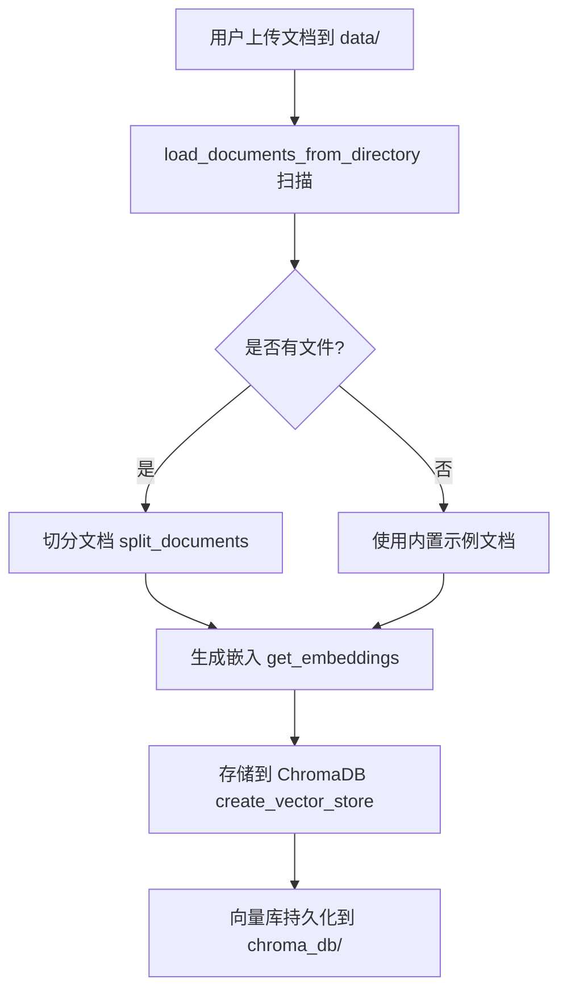
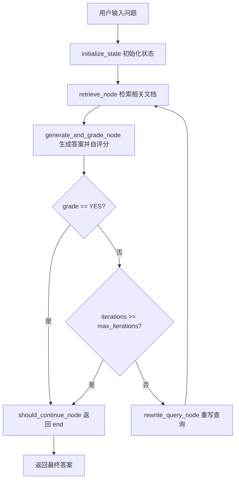
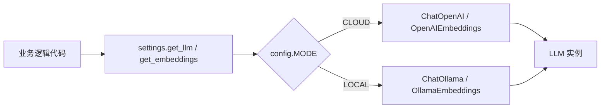

# 📘 RAG2 - Self-RAG System 核心上下文 (AI 专用记忆库)

> **用途**：此文件供 AI 助手在每次对话开始时阅读，以快速建立对项目的全局认知，无需重新扫描所有代码。
> **最后更新时间**：2026-03-23
> **项目版本**：v1.0 (生产就绪)

## 1. 项目概览 (Project Overview)

- **核心功能**：基于 LangGraph 的 Self-RAG（自反思检索增强生成）系统，支持 Cloud (OpenAI GPT-4o) 和 Local (Ollama) 双模式无缝切换，实现多跳推理和自动查询优化。
- **技术栈**：Python 3.10+, LangChain, LangGraph, ChromaDB, Ollama, OpenAI API, Pydantic Settings, Streamlit
- **入口文件**：
  - **CLI 模式**：`python main.py` 或启动脚本 `start.bat` (Windows) / `start.sh` (Linux/Mac)
  - **GUI 模式**：`streamlit run app.py` （新增 Streamlit Web 界面）

## 2. 目录结构速览 (Directory Structure)

```text
RAG2/
├── main.py                      # 主入口：CLI 交互界面
├── requirements.txt              # Python 依赖
├── .env.example                 # 配置模板
├── .gitignore                   # Git 忽略文件
├── start.bat / start.sh          # 平台启动脚本
├── data/                        # 用户文档目录（自动创建）
│   └── example.txt              # 示例文档
├── chroma_db/                   # 向量数据库（自动生成）
└── src/
    ├── config/
    │   ├── __init__.py
    │   └── settings.py          # 双模式配置工厂（核心）
    ├── graph/
    │   ├── __init__.py
    │   ├── state.py             # LangGraph 状态模式定义
    │   ├── nodes.py             # RAG 节点实现（检索/生成/评分/重写）
    │   └── workflow.py          # LangGraph 工作流组装
    ├── ingestion/
    │   ├── __init__.py
    │   └── loader.py            # 文档加载与向量化
    ├── api/
    │   ├── __init__.py
    │   └── rag_api.py           # API 封装模块（用于集成到其他系统）
    └── utils/
        ├── __init__.py
        ├── json_parser.py        # 本地模型 JSON 清洗工具
        └── checks.py             # 系统健康检查
```

## 3. 关键函数映射表 (Key Functions Map)

| 模块功能 | 文件路径 | 关键函数/类 | 职责描述 | 输入/输出特征 |
| :--- | :--- | :--- | :--- | :--- |
| **双模式配置工厂** | `src/config/settings.py` | `get_llm()` | 根据当前模式返回 LLM 实例 | 输入：无 / 输出：`BaseChatModel` (ChatOpenAI 或 ChatOllama) |
| | | `get_embeddings()` | 根据当前模式返回嵌入模型 | 输入：无 / 输出：`Embeddings` (OpenAIEmbeddings 或 OllamaEmbeddings) |
|| | `config` | Pydantic 配置实例，从 .env 加载 | 属性：`MODE`, `OPENAI_API_KEY`, `OLLAMA_CHAT_MODEL` 等 |
| **文档加载系统** | `src/ingestion/loader.py` | `load_documents_from_directory()` | 从文件夹加载支持的文档格式 | 输入：`directory: str` / 输出：`List[Document]`（带元数据） |
| | | `get_vector_store()` | 获取或创建 ChromaDB 向量库 | 输入：`persist_directory: str` / 输出：`Chroma` 实例 |
| | | `split_documents()` | 将文档切分为小块 | 输入：`documents`, `chunk_size`, `chunk_overlap` / 输出：`List[Document]` |
| **RAG 节点** | `src/graph/nodes.py` | `retrieve_node()` | 基于当前查询检索相关文档 | 输入：`state: SelfRAGState` / 输出：更新后的 state（含 context） |
| | | `generate_and_grade_node()` | 生成答案并自我评分质量 | 输入：`state: SelfRAGState` / 输出：更新后的 state（含 answer, grade, reason） |
| | | `rewrite_query_node()` | 根据评分原因重写查询 | 输入：`state: SelfRAGState` / 输出：更新后的 state（含 current_query, iterations+1） |
| | | `should_continue_node()` | 决定继续迭代或结束 | 输入：`state: SelfRAGState` / 输出：`"end"` 或 `"continue"` |
| **LangGraph 工作流** | `src/graph/workflow.py` | `create_self_rag_workflow()` | 组装完整的 Self-RAG 有向图 | 输入：`max_iterations: int` / 输出：`StateGraph` 实例 |
| | | `initialize_state()` | 初始化问题状态 | 输入：`question: str`, `max_iterations: int` / 输出：`SelfRAGState` 字典 |
| **JSON 容错处理** | `src/utils/json_parser.py` | `parse_json_safely()` | 多策略安全解析本地模型输出 | 输入：`text: str` / 输出：`Dict[str, Any]` |
| | | `clean_json_text()` | 清洗和修复常见 JSON 格式问题 | 输入：`text: str` / 输出：`str`（修复后的 JSON） |
| | | `validate_json_structure()` | 验证 JSON 包含必需字段 | 输入：`data: Dict`, `required_keys: list` / 输出：`bool` |
| **健康检查** | `src/utils/checks.py` | `check_local_mode_prerequisites()` | Local 模式前置条件综合检查 | 输入：无 / 输出：`List[str]`（检查消息） |
| | | `check_ollama_connection()` | 检查 Ollama 服务连通性 | 输入：`base_url: str` / 输出：`bool` |
| | | `check_model_exists()` | 检查 Ollama 中是否存在指定模型 | 输入：`model_name: str` / 输出：`bool` |
| **CLI 入口** | `main.py` | `process_question()` | 处理用户问题通过 Self-RAG 工作流 | 输入：`question: str`, `workflow: StateGraph` / 输出：最终 state |
| | | `main()` | 主函数：初始化系统并启动交互循环 | 输入：无 / 输出：无 |
| **API 封装** | `src/api/rag_api.py` | `RAG2API` | RAG2 系统的 API 封装类（单例模式） | 输入：`max_iterations: int`, `auto_init: bool` / 输出：RAG2API 实例 |
| | | `RAG2API.ask()` | 问问题并返回结果 | 输入：`question: str`, `return_context: bool`, `return_metadata: bool` / 输出：`Dict`（含 answer, grade, iterations 等） |
| | | `RAG2API.batch_ask()` | 批量处理问题 | 输入：`questions: List[str]`, `return_context: bool` / 输出：`List[Dict]` |
| | | `RAG2API.get_statistics()` | 获取向量数据库统计信息 | 输入：无 / 输出：`Dict`（含 documents, chunks） |
| | | `RAG2API.health_check()` | 检查系统健康状态 | 输入：无 / 输出：`Dict`（含 status, mode, initialized 等） |
| | | `ask_question()` | 快速提问函数（便捷封装） | 输入：`question: str`, `**kwargs` / 输出：`Dict`（同 ask()） |

## 4. 数据流向架构 (Data Flow Architecture)

### 入库流程



**详细流程**：
1. 用户将 `.txt`, `.md`, `.rst`, `.log` 文件放入 `./data/` 文件夹
2. `load_documents_from_directory()` 扫描文件夹，加载支持的文件格式
3. 每个文件附加元数据：`{source, filepath, filetype, size}`
4. `split_documents()` 使用 `RecursiveCharacterTextSplitter` 切分文档（500 字符块，50 字符重叠）
5. `get_embeddings()` 根据当前模式（Cloud/OpenAI 或 Local/Ollama）生成向量嵌入
6. `Chroma.from_documents()` 创建并持久化向量库到 `./chroma_db/`

### 问答流程



**详细流程**：
1. 用户在 CLI 输入问题
2. `initialize_state()` 创建初始状态：`{question, current_query, context=[], iterations=0}`
3. **Iteration N**:
   - `retrieve_node()` 使用 `vector_store.similarity_search(k=4)` 检索相关文档
   - `generate_and_grade_node()`：
     - 构建包含 context 的 prompt
     - 调用 `get_llm()` 生成答案和评分（JSON 格式）
     - 使用 `parse_json_safely()` 容错解析
   - `should_continue_node()`：
     - 如果 `grade == "YES"` → 返回 `"end"`
     - 如果 `iterations >= max_iterations` → 返回 `"end"`
     - 否则返回 `"continue"`
4. **如果继续**:
   - `rewrite_query_node()` 根据评分原因重写查询
   - `iterations` 递增
   - 循环回到第 3 步
5. 返回最终答案和元数据

### 双模式切换架构



**关键设计原则**：
- 业务逻辑代码（`nodes.py`, `workflow.py`）**严禁直接导入**模型类
- 所有 LLM 调用必须通过 `settings.get_llm()` 工厂函数
- 切换模式只需修改 `.env` 文件，无需改动任何业务代码

## 5. 配置与环境规范 (Configuration & Conventions)

### 环境变量

| 变量名 | 模式 | 必需性 | 默认值 | 说明 |
| :--- | :--- | :--- | :--- | :--- |
| `MODE` | 两者 | 必需 | `CLOUD` | 运行模式：`CLOUD` 或 `LOCAL` |
| `OPENAI_API_KEY` | Cloud | 必需 | (无) | OpenAI API 密钥 |
| `OLLAMA_BASE_URL` | Local | 可选 | `http://localhost:11434` | Ollama 服务地址 |
| `OLLAMA_CHAT_MODEL` | Local | 必需 | `llama3:8b` | 聊天模型名称 |
| `OLLAMA_EMBED_MODEL` | Local | 必需 | `nomic-embed-text` | 嵌入模型名称 |
| `CHROMA_PERSIST_DIR` | 两者 | 可选 | `./chroma_db` | 向量库存储路径 |
| `MAX_ITERATIONS` | 两者 | 可选 | `3` | 最大检索迭代次数 |
| `RETRIEVAL_K` | 两者 | 可选 | `4` | 每次检索的文档数 |

### 路径约定

- **数据目录**：`./data/` - 用户放置自定义文档的文件夹
- **向量库**：`./chroma_db/` - ChromaDB 持久化存储位置
- **配置文件**：`.env` - 环境变量配置（不提交到 Git）
- **配置模板**：`.env.example` - 配置示例（可提交到 Git）

### 编码规范

1. **类型提示**：所有函数必须包含完整的 Type Hints
   ```python
   def retrieve_node(state: SelfRAGState) -> SelfRAGState:
       ...
   ```

2. **错误处理**：
   - 使用 `try-except` 块捕获异常
   - 提供清晰的错误消息
   - 本地模型使用多策略容错（JSON 解析）

3. **JSON 处理**：
   - LLM 响应必须通过 `parse_json_safely()` 解析
   - 使用 `validate_json_structure()` 验证结构
   - 本地模型可能输出 Markdown 代码块或格式错误

4. **状态管理**：
   - 所有节点函数返回完整的 state 更新
   - 使用 `{**state, "new_key": new_value}` 模式更新
   - 避免直接修改传入的 state 参数

5. **模型解耦**：
   - 禁止直接 `from langchain_openai import ChatOpenAI`
   - 必须使用 `from src.config.settings import get_llm`
   - 所有 LLM 调用：`llm = get_llm()`

## 6. 当前开发状态 (Current Status & TODOs)

### ✅ 已完成 (Completed)

1. **核心 Self-RAG 逻辑**：
   - ✅ LangGraph 状态模式定义 (`state.py`)
   - ✅ 四个核心节点实现：检索、生成评分、查询重写、继续判断 (`nodes.py`)
   - ✅ 完整工作流组装（条件边、循环）(`workflow.py`)

2. **双模式支持**：
   - ✅ 配置工厂模式（Cloud/OpenAI + Local/Ollama）(`settings.py`)
   - ✅ 零业务逻辑耦合
   - ✅ 自动模型实例化

3. **文档加载系统**：
   - ✅ 智能加载策略（文件夹优先 → 内置回退）(`loader.py`)
   - ✅ 支持多种文件格式（`.txt`, `.md`, `.rst`, `.log`)
   - ✅ 文档元数据支持
   - ✅ ChromaDB 持久化

4. **本地模型优化**：
   - ✅ JSON 容错解析（多策略）(`json_parser.py`)
   - ✅ Ollama 健康检查（连通性、模型存在性）(`checks.py`)
   - ✅ 无 API Key 设计（Ollama 不需要）

5. **CLI 界面**：
   - ✅ 彩色输出（colorama）
   - ✅ 详细进度显示（迭代、检索、评分、重写）
   - ✅ 友好错误消息
   - ✅ 交互式问答循环

6. **工程完善**：
   - ✅ 启动脚本（Windows/Linux/Mac）
   - ✅ 完整 README 文档
   - ✅ Git 配置（`.gitignore`）
   - ✅ 依赖管理（`requirements.txt`）

7. **API 封装模块**：
   - ✅ RAG2API 类实现（单例模式）(`src/api/rag_api.py`)
   - ✅ ask() 方法 - 单个问题处理
   - ✅ batch_ask() 方法 - 批量问题处理
   - ✅ get_statistics() 方法 - 获取统计信息
   - ✅ health_check() 方法 - 健康检查
   - ✅ ask_question() 便捷函数 - 快速提问
   - ✅ 完整测试程序 (`test_api.py`)

### 🚧 进行中/待完善 (In Progress)

- 无显著待完成功能，系统已生产就绪。

### 💡 建议下一步 (Recommended Next Steps)

1. **添加 Web UI**：
   - 使用 Streamlit 或 Gradio 创建 Web 界面
   - 实现文件上传功能
   - 添加可视化检索结果展示

2. **增强功能**：
   - 添加 Web 搜索集成（DuckDuckGo）
   - 实现查询缓存（减少重复查询成本）
   - 添加 RAGAS 评估指标

3. **性能优化**：
   - 实现并行检索
   - 添加向量库缓存预热
   - 支持批量查询处理

4. **部署支持**：
   - 添加 Docker 支持
   - 实现 API 服务（FastAPI）
   - 添加日志和监控

---

## 7. API 模块集成指南 (API Integration Guide)

### 7.1 快速开始

RAG2 提供了简洁的 API 模块，可以轻松集成到任何 Python 项目中。

```python
# 方式 1：使用类（推荐用于多个问题）
from src.api.rag_api import RAG2API

api = RAG2API()
result = api.ask("什么是 Self-RAG？")
print(result['answer'])

# 方式 2：使用快速函数（适合单个问题）
from src.api.rag_api import ask_question

result = ask_question("LangGraph 的特点")
print(result['answer'])
```

### 7.2 API 方法详解

#### RAG2API 类

**初始化参数**：
- `max_iterations` (int): 最大迭代次数，默认 3
- `auto_init` (bool): 是否自动初始化，默认 True

**主要方法**：

1. **ask()** - 处理单个问题
   ```python
   result = api.ask(
       question="你的问题",
       return_context=False,  # 是否返回检索文档
       return_metadata=False  # 是否返回完整元数据
   )
   
   # 返回格式
   {
       "question": "你的问题",
       "answer": "生成的答案",
       "grade": "YES",  # 或 "NO"
       "reason": "评分原因",
       "iterations": 1,
       "max_iterations": 3,
       "success": True
   }
   ```

2. **batch_ask()** - 批量处理问题
   ```python
   questions = ["问题1", "问题2", "问题3"]
   results = api.batch_ask(questions, return_context=False)
   ```

3. **get_statistics()** - 获取统计信息
   ```python
   stats = api.get_statistics()
   # 返回: {"documents": 10, "chunks": 50, "success": True}
   ```

4. **health_check()** - 健康检查
   ```python
   health = api.health_check()
   # 返回: {"status": "healthy", "mode": "LOCAL", ...}
   ```

### 7.3 集成示例

#### 示例 1：集成到 Flask 应用

```python
from flask import Flask, request, jsonify
from src.api.rag_api import RAG2API

app = Flask(__name__)
api = RAG2API()

@app.route('/api/ask', methods=['POST'])
def ask():
    data = request.json
    result = api.ask(data['question'])
    return jsonify(result)
```

#### 示例 2：集成到数据分析流程

```python
import pandas as pd
from src.api.rag_api import RAG2API

api = RAG2API()

# 对 DataFrame 中的每个问题进行处理
df = pd.DataFrame({"问题": ["Q1", "Q2", "Q3"]})
df['答案'] = df['问题'].apply(lambda q: api.ask(q)['answer'])
```

### 7.4 测试 API 模块

运行测试程序：

```bash
# 自动化测试
python test_api.py

# 交互式测试
python test_api.py --mode interactive
```

测试程序包含：
- ✅ 基本用法测试
- ✅ 快速函数测试
- ✅ 上下文返回测试
- ✅ 批量处理测试
- ✅ 健康检查测试
- ✅ 错误处理测试
- ✅ 单例模式验证

### 7.5 集成到其他项目

#### 作为子模块集成

1. **复制模块到您的项目**
   ```bash
   cp -r /path/to/RAG2/src ./libs/
   ```

2. **安装依赖**
   ```bash
   pip install -r /path/to/RAG2/requirements.txt
   ```

3. **在代码中使用**
   ```python
   from libs.api.rag_api import RAG2API
   api = RAG2API()
   result = api.ask("你的问题")
   ```

#### 配置管理

通过 `.env` 文件配置：

```env
# 本地模式
MODE=LOCAL
OLLAMA_CHAT_MODEL=qwen3-vl:8b
OLLAMA_EMBED_MODEL=nomic-embed-text

# 或云端模式
MODE=CLOUD
OPENAI_API_KEY=your_api_key_here
```

### 7.6 最佳实践

1. **单例模式**：RAG2API 使用单例模式，多次初始化会返回同一实例
   ```python
   api1 = RAG2API()
   api2 = RAG2API()
   print(api1 is api2)  # True
   ```

2. **错误处理**：
   ```python
   result = api.ask("你的问题")
   if result['success']:
       print(result['answer'])
   else:
       print(f"错误: {result.get('error', '未知错误')}")
   ```

3. **性能优化**：在应用启动时初始化，避免重复初始化
   ```python
   # 在应用启动时
   api = RAG2API()
   
   # 在请求处理中直接使用
   def handle_request(question):
       return api.ask(question)
   ```

---

## 联系与更新

如需更新此文件，请对 AI 说："根据最新的代码变更，更新 `PROJECT_CONTEXT.md`"

AI 将重新扫描代码并刷新这份"记忆"。
